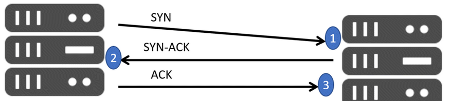
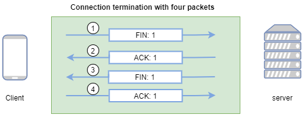
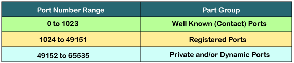
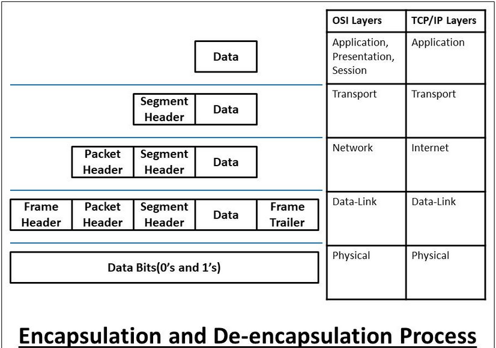
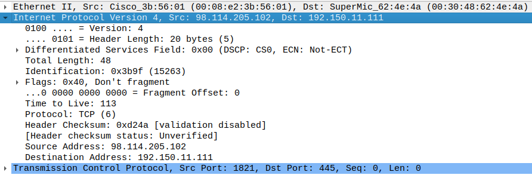
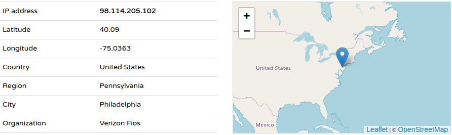
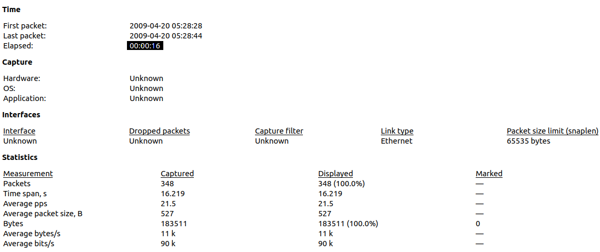
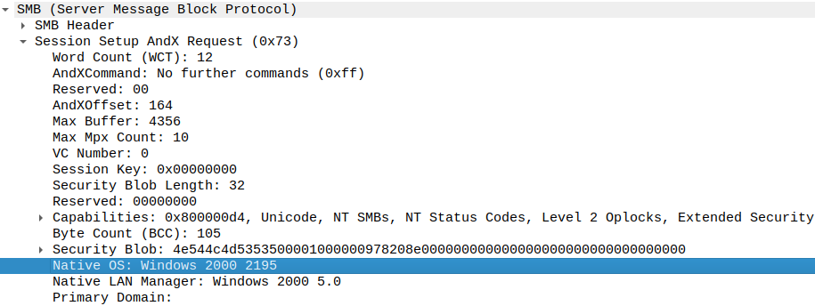
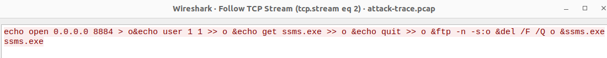

# TCP/IP

TCP/IP stands for Transmission Control Protocol/Internet Protocol and is a suite
of communication protocols used to interconnect network devices on the internet. 
TCP/IP is also used as a communications protocol in a private computer network 
(an intranet or extranet).  
In other words, TCP/IP is just a set of rules and conventions network devices 
follow into order to exchange data over a network (LAN or WAN).  
So the main purpose of challenge this to have a better understanding of TCP/IP
model.

## Task 1


### 1. What are the differences between the OSI model and the TCP/IP model ?

|               OSI Model                |                TCP/IP                 |
|:---------------------------------------|:--------------------------------------|
| stands for Open System Interconnection | stands for Transmission Control Protocol |
| developed by ISO | developed by ARPANET |
| It consists of 7 layers | It consists of 4 layers |
| Based on a vertical approach | Based on a horizontal approach |
| Less used or used as reference | highly used |
| Generic protocol used as a communication gateway between the network and the end user | Standard protocol that lead to the development of internet |

### 2. [List the different layers of the TCP/IP model](https://www.guru99.com/difference-tcp-ip-vs-osi-model.html)


### 3. [Give some examples of protocols and indicate which one of TCP/IP model layer they refer to](https://docs.oracle.com/cd/E19455-01/806-0916/ipov-10/index.html)


### 3. [Explain how a connection gets established, in other words, explain the "3-way handshake" process ?](https://www.guru99.com/tcp-3-way-handshake.html)



|                  Message               |            Description              |
|:---------------------------------------|:------------------------------------|
| SYN | Used to initiate and establish a connection. It also helps you to synchronize sequence numbers between devices |
| SYN_ACK | SYN message from local device and ACK of the earlier packet |
| ACK | Helps to confirm to the other side that it has received the SYN |
| FIN | Used to terminate a connection |

### 4. Explain how a connection is terminated, in other words, explain the "4-way disconnect" process ?



When the data stream transportation is over, the TCP connection needs to be 
terminate safely.For that reason four things need to happen:

- Each node has send a FIN flag to its peer (that’s two things, one FIN in each direction)
- Each node has received a ACK flag of its own FIN flag from its peer (that’s two things)

### 5. Explain what are the "sequence number" and "acknowledgment number" in TCP

When the sender is ready to send data. It organizes data into different segment.
It assignes sequence number to each segment. Thoses sequence numbers are ordered
and identified a specific segment.  
So the receiver sends an acknowledgment number to let the sender know that, he 
receives up to segment N and he's waiting for the segment N + 1.

### 6. What is the fundamental difference between TCP and UDP ?

**TCP:** Makes sure that packet has reach the destination otherwise resend it.
It's good for applications that require reliability. 
**UDP:** Doesn't not ensure delivery and is used for applications that are sensible to delay instead of reliability.

### 7. What are TCP ports? How many of them are they? What are the three main categories of TCP Ports (with there associated range)?

|   Port                              |   Description |
|:------------------------------------|:---------------------------------------|
| TCP Port | An integer that represents or identifies an application. It allows establishing a connection or a circuit between applications on both sides |
|Well-known ports | Identify most common applications and services such as HTTP, HTTPS, SSH, ... |
| Registered ports |  used for the user processes |
| Dynamic ports | Another name of the dynamic port is ephemeral ports. These port numbers are assigned to the client application dynamically when a client creates a connection |



### 8. Provide three examples of well-know port numbers and tell to which Application layer protocol they refer to

| PORT NUMBER | TRANSPORT PROTOCOL | SERVICE NAME  |
|:------------|:-------------------|:-----------------------------|
| 20, 21      |    TCP             | File Transfer Protocol (FTP) |
| 22          |  TCP, UDP          | Secure Shel (SSH)            |
| 23          |     TCP            | Telnet                       |
| 80          |     TCP            | HyperText Transfer Protocol (HTTP) |

### 9. [Explain the concept of TCP packets and how they are build over the layer flow](https://afteracademy.com/blog/what-is-data-encapsulation-and-de-encapsulation-in-networking)



## Task 2: analysing a suspicious piece of network traffic captured in a pcap file

### Which systems (i.e. IP addresses) are involved ?

Two devices are involved and theirs IPs are: `98.114.205.102` (source) and `192.150.11.111` (destination)



### What can you find out about the attacking host (e.g., where is it located) ?

Thanks to this [website](https://iplocation.com/), we found the following location: 



### How many TCP sessions are contained in the dump file?

```bash

$ tcpdump -nr attack-trace.pcap 'tcp[tcpflags] & (tcp-syn|tcp-ack) = (tcp-syn|tcp-ack)' | wc -l
reading from file attack-trace.pcap, link-type EN10MB (Ethernet), snapshot length 65535
5
```

### How long did it take to perform the attack?

In wireshark GUI, go to Statistics > Capture File properties



### Which operating system was targeted by the attack? And which service? Which vulnerability?



**OS:** Windows  
**Service:** Server Message Block (SMB) via port 445.  
**Vulnerability:** Remote code execution vulnerability.

### Can you sketch an overview of the general actions performed by the attacker?



### Which are the protocols involved? What can you tell about the payload?
