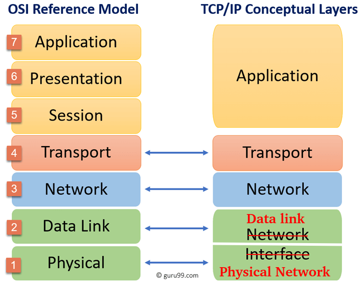
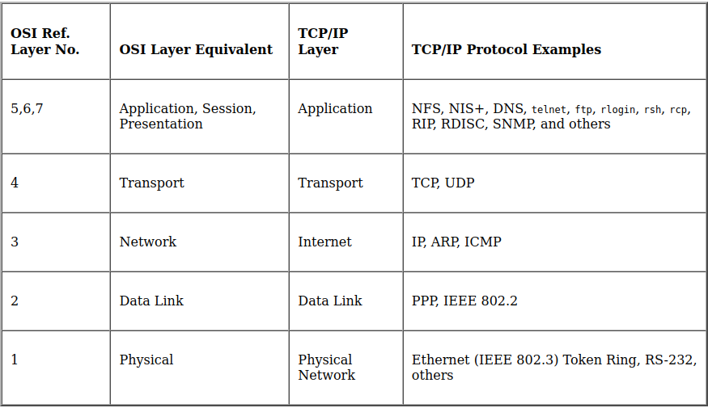

# TCP/IP

TCP/IP stands for Transmission Control Protocol/Internet Protocol and is a suite
of communication protocols used to interconnect network devices on the internet. 
TCP/IP is also used as a communications protocol in a private computer network 
(an intranet or extranet).  
In other words, TCP/IP is just a set of rules and conventions network devices 
follow into order to exchange data over a network (LAN or WAN).  
So the main purpose of challenge this to have a better understanding of TCP/IP
model.

## Task 1

### 1. What are the differences between the OSI model and the TCP/IP model ?

|               OSI Model                |                TCP/IP                 |
|:--------------------------------------:|:-------------------------------------:|
| stands for Open System Interconnection | stands for Transmission Control Protocol |
| developed by ISO | developed by ARPANET |
| It consists of 7 layers | It consists of 4 layers |
| Based on a vertical approach | Based on a horizontal approach |
| Less used or used as reference | highly used |
| Generic protocol used as a communication gateway between the network and the end user | Standard protocol that lead to the development of internet |

### 2. [List the different layers of the TCP/IP model](https://www.guru99.com/difference-tcp-ip-vs-osi-model.html)

### 5. [Give some examples of protocols and indicate which one of TCP/IP model layer they refer to](https://docs.oracle.com/cd/E19455-01/806-0916/ipov-10/index.html)

### 6. Explain how a connection gets established, in other words, explain the "3-way handshake" process ?

### 7. Explain how a connection is terminated, in other words, explain the "4-way disconnect" process ?

### 8. Explain what are the "sequence number" and "acknowledgment number" in TCP

### 9. What is the fundamental difference between TCP and UDP ?

### 10. What are TCP ports? How many of them are they? What are the three main categories of TCP Ports (with there associated range)?

### 11. Provide three examples of well-know port numbers and tell to which Application layer protocol they refer to

### 12. Explain the concept of TCP packets and how they are build over the layer flow.

## Task 2: analysing a suspicious piece of network traffic captured in a pcap file

### Which systems (i.e. IP addresses) are involved ?

Two devices are involved and theirs IPs are: `98.114.205.102` and `192.150.11.111`

### What can you find out about the attacking host (e.g., where is it located) ? 

### How many TCP sessions are contained in the dump file?

### How long did it take to perform the attack?

### Which operating system was targeted by the attack? And which service? Which vulnerability?

### Can you sketch an overview of the general actions performed by the attacker? 

### Which are the protocols involved? What can you tell about the payload?
