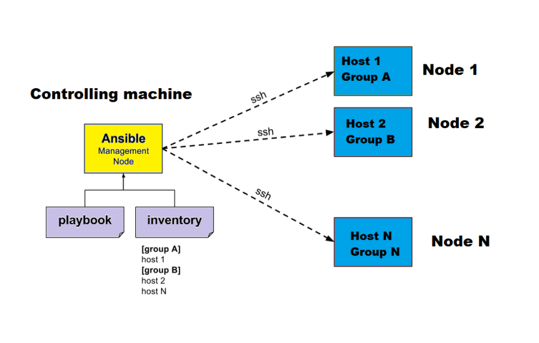
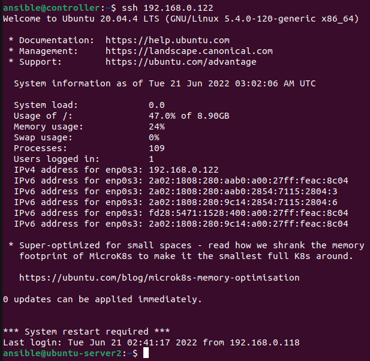
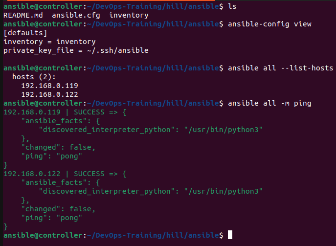
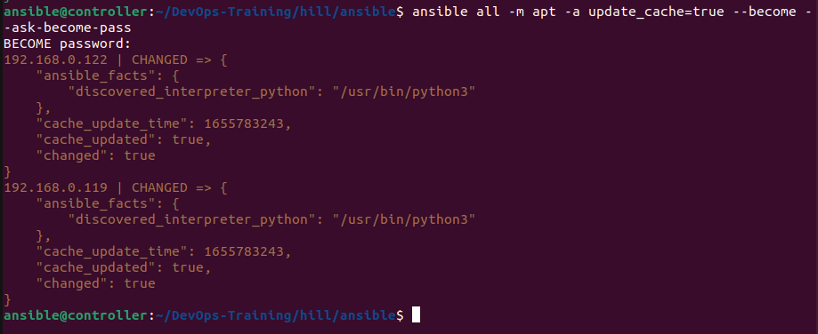
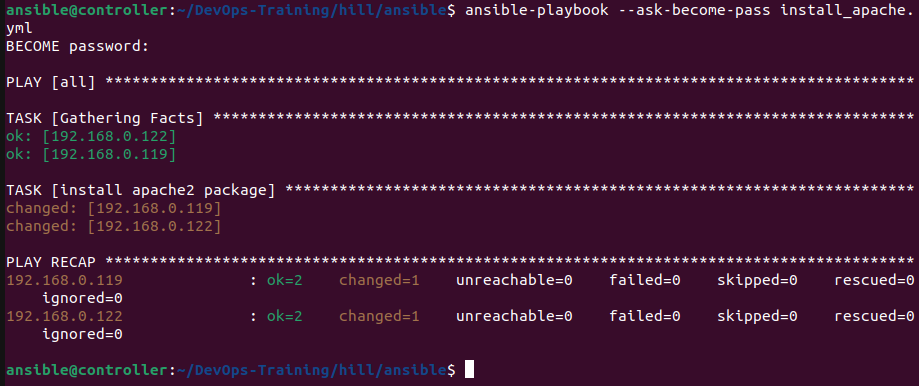
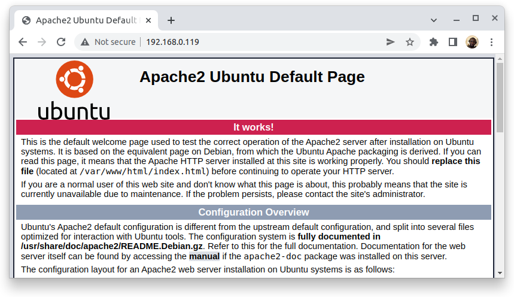
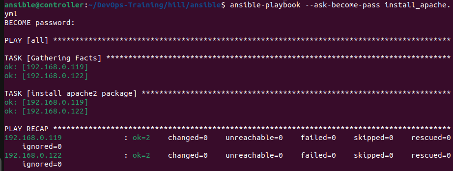

# Basics



To get acquainted with ansible, Set up a development environment similar to 
the image just above. Create 3 VMs with virtualBox: one controlling 
machine running ansible and containing required files, two servers. Make sure OpenSSH is installed to allow ssh connection. Also use Bridged adaptors so that, 
VMs will be allocated with IPs in the same network than your host machine.


Make sure to ssh servers from the controlling machine.

First of all ssh in the controlling machine using password. Then from there, ssh
into servers using also password.  
Next, Create ssh key (using ed25519):  
`ssh-keygen -t ed25519 -C "username"`  
Add the secret key to the ssh agent:  
`eval $(ssh-agent -s) && ssh-add ~/.ssh/id_ed25519`   
Copy the public key into servers (nodes)  
`ssh-copy-id -i ~/.ssh/id_ed25519.pub 192.168.0.122`  
Finally, ssh into server without password.



## Ansible Ad Hoc commands



## Running elevated ad-hoc commands

As you may know, running `apt update` command will fail for non root user but 
`sudo apt update` will work for non root user with sudo privileges.  
Ansible uses `become` flag to take care of that. `ask-become-pass` is used to
ask for password. In this case the controlling machine and the servers should 
have the same password.



## Playbook

Ad-hoc commands are not reusable and this defeats the purpose of ansible which 
focus on tasks automation. For that reason playbooks are used to automate.

Here is simple playbook with one task.

```yaml
---

- hosts: all
  become: true
  tasks:

  - name: install apache2 package
    apt:
      name: apache2
```



As you can see changes have been made into servers. Apache2 server has been installed in both servers and are running. Let's check it out.



Running the same playbook again won't reinstall apache2 because Ansible keeps 
track of the state.

