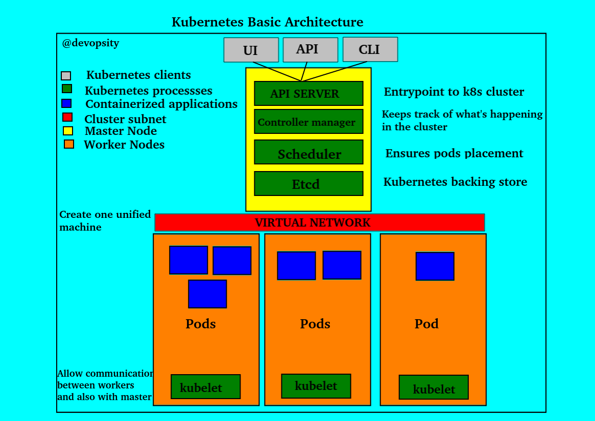

# What is kubernetes ?

Kubernetes is a container orchestration tool. It helps you manage containerized 
applications in different deployment environments: physical, virtual and cloud.

## What problem does kubernetes solve ?

The rise of microservices increased the usage of containers which implies the 
need of containers orchestration tool.

## What features do orchestration tool offer ?

1. **High availability**: no downtime and always available to users.
2. **Scalability**: High performance, fast loading and fast response.
3. **Disaster recovery**: no data lost, a mecanism to backup data and restore
the system to it latest state after a disaster.

## Basic architecture

## Basic Concepts

### Pod
A pod is the smallest unit of kubernetes cluster that you can interact with. 
Usually there is one pod per application, a pod is then a container wrapper. 
Each pod is its own self contained server with an IP address assigned by the 
virtual network.

### Deployment

Pods are the basic unit of computation in kubernetes, but they are not directly
created in the cluster. Instead, kubernetes provides another level of 
abstraction such as **deployment**.

A deployment is a resource object in Kubernetes that provides declarative updates 
to applications. A deployment allows you to describe an application's life cycle, 
such as which images to use for the app, the number of pods there should be, and 
the way in which they should be updated.
